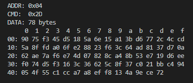

# wake-rs

[](https://crates.io/crates/wake-rs)
[](https://docs.rs/wake-rs)
[](./LICENSE)

`wake-rs` is a library written in Rust for encoding/decoding Wake protocol.

`Wake` is a serial communication protocol highly optimized for **microcontrollers**. It based on SLIP protocol (<https://datatracker.ietf.org/doc/html/rfc1055>).



## Main features

- unique start symbol
- 7-bit addressing (optional)
- CRC (8 or 16 bits)
- low overhead

The protocol doesn't support:

- ~~error correction~~
- ~~compression~~

Frame structure:


## Integrations

There are many architecture-specific implementations:

- MCS-51
- AVR
- STM32
- x86

in many languages:

- C
- C++
- C#
- Python
- Rust

## Examples

1. Demo - basic usage
2. Serial - how to use with serial port
3. Relay shield - PC <-> device communication

## Quick Start

Add to your Rust project:

```bash
cargo add systemd-wake
```

Create, encode and decode packet:

```rust
use wake_rs::{Decode, Encode};

fn main() {
    let wp = wake_rs::Packet {
        address: Some(0x12),
        command: 3,
        data: Some(vec![0x00, 0xeb]),
    };

    let encoded = wp.encode().unwrap();
    let decoded = encoded.decode();
}
```

Build library:

```bash
cargo build --release
```

Build examples:

```bash
cargo build --examples
```

## Resources

Protocol description, libraries, and tools: <http://www.leoniv.diod.club/articles/wake/wake.html>

## TODO

- Use this library with a microcontroller (nostd)
- Add a stream decoder (one byte per time with internal buffer)

## License

Code released under the MIT License.
